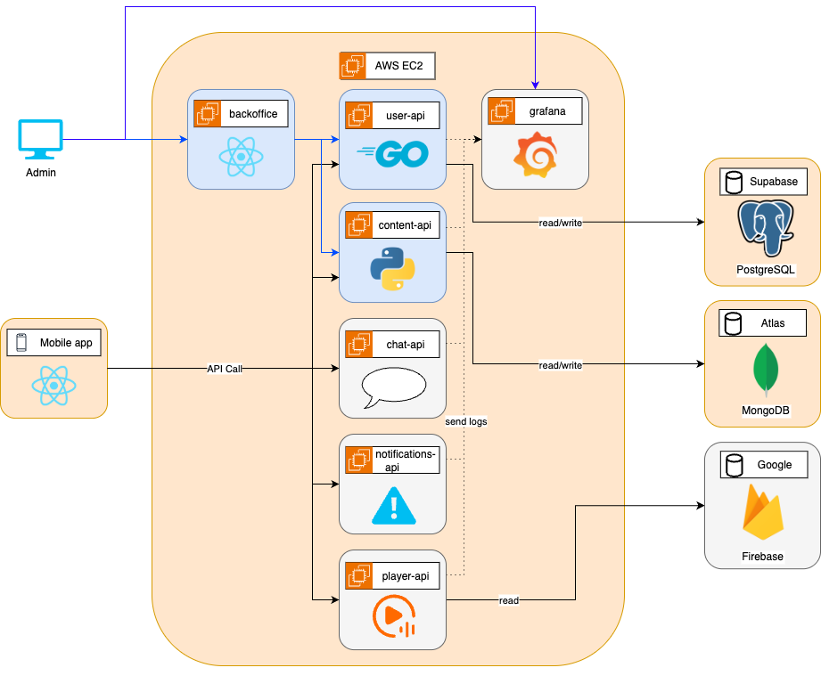

# 🎶 Proyecto Melodía – Documentación Integral

Bienvenido al repositorio central de **documentación** del proyecto **Melodía**, desarrollado en el marco de la materia **Ingeniería de Software II (FIUBA)**.

Aquí se encuentran recopilados los conceptos principales, la planificación, las decisiones de arquitectura y la organización general del desarrollo.  

Cada repositorio complementario incluye documentación específica de su implementación, pero este espacio busca **unificar la visión global del proyecto**.

👉 [Documentación del Proyecto](https://fiuba-ingsoft2-grupo8.github.io/)

## 📖 Introducción

En este repositorio se encuentra toda la **documentación integral** relacionada al proyecto:

- ✅ Decisiones de arquitectura.
- ✅ Tareas realizadas por sprint.
- ✅ Problemas detectados.
- ✅ Stacks tecnológicos elegidos.
- ✅ Explicaciones de uso y de despliegue.

La idea principal es **englobar los conceptos más grandes** y dejar asentada una planificación tentativa sobre cómo se organizará el desarrollo del trabajo práctico.

## 🏗️ Arquitectura Global

Actualmente la arquitectura esta formada por los siguientes servicios:
- Mobile app: App mobile que se conecta a 'user-api' y 'content-api'.
- Backoffice: Página web para administrar.
- User API: Gestión de usuarios.
- Content API: Gestión de contenido como artistas, canciones y playlists.
- Player API: Gestión de la reproducción de las canciones.
- Chat API: Gestión de los chats entre usuarios.
- Notification API: Gestión del sistema de notificaciones.
- PostgreSQL.
- MongoDB.
- Supabase.
- Firebase.
- Datadog: Recibe los logs de todos los servicios y se generan dashboards para mejorar la visibilidad sobre todo el sistema.

## ♾️ CI/CD

Cada microservicio contará con un pipeline de **CI/CD** independiente para garantizar **calidad**, **minimizar errores en producción** y **acelerar el ciclo de feedback**.

### 🔄 Continuous Integration (CI)

El flujo de CI corre cada vez que se realiza un PR o un cambio en las ramas main y develop.

**Infraestructura:** Utilizamos **GitHub Actions** con runners hosteados por GitHub, proporcionando mayor velocidad y confiabilidad.

**Pipeline de CI incluye:**
- 🧪 **Testing automatizado:** Cobertura mínima del 75% con reportes automáticos en cada PR.
- ✅ **Validaciones de calidad:** Linters, formatters y análisis estático de código.

**Flujo específico por tecnología:**
- **Backend (Node.js/Python):** Jest/PyTest + ESLint/Pylint + SonarQube.
- **Frontend (React Native):** Jest + ESLint + Expo CLI validations.
- **Docker:** Hadolint para validación de Dockerfiles.

### 🚀 Continuous Deployment (CD)

El flujo de CD corre luego de realizar un merge o un push en la rama main.

**Proceso automatizado en dos etapas:**

1. **Build & Registry:**
   - 📦 Construcción de imagen Docker optimizada (multi-stage builds).
   - ⬆️ Push automatizado a **Docker Hub** con versionado.

2. **Deployment:**
   - 🔄 Pull de la nueva imagen desde el registro.
   - 🗑️ Eliminación controlada del contenedor anterior.
   - 🟢 Despliegue con **zero-downtime** usando health checks.
   - 🔐 Gestión segura de variables de entorno via **GitHub Secrets**.

Se utilizan secretos de Github para compartir variables de entorno.

### ♟️ Estrategias CI/CD por Componente

#### 📊 Microservicios (Backend)
- **CI/CD completo:** Pipeline integral con testing, build y deployment automatizado.
- **Testing robusto:** Pruebas unitarias y de integración con **cobertura mínima del 75%**.
- **Deployment:** Deployment en AWS EC2.
- **Monitoreo:** Health checks, logs estructurados y métricas de performance.

#### 🖥️ Backoffice (Web)
- **CI robusto:** Linting, testing y análisis de bundle size.
- **Deployment:** Deployment en AWS EC2.

#### 📱 Aplicación Móvil (React Native + Expo)
- **CI enfocado en calidad:** Validaciones de linter y formatter.
- **Build automatizado:** Generación de APK/IPA en cada release.
- **Distribución:** Deploy manual del APK.

## 🏗️ Infraestructura y Servicios

Nuestro ecosistema utiliza una infraestructura cloud:

### 🖥️ Compute & Hosting

#### **Amazon EC2 - Instancias t3.micro**
- **user-api:** Microservicio de gestión de usuarios.
- **content-api:** Microservicio de gestión de contenido.
- **backoffice:** Aplicación web administrativa.
- **player-api:** Microservicio de gestión de reproducción.
- **chat-api:** Microservicio de gestión de chats.
- **notifications-api:** Microservicio de gestión de notificaciones.

**Características:**
- ⚡ 2 GB de memoria RAM.
- 🌍 Región AWS optimizada para latencia en América del Sur.
- 🔒 Configuración con security groups restrictivos.

### 🗄️ Bases de Datos

#### **Supabase - PostgreSQL**
- 🔧 **Uso:** Base de datos relacional principal.
- ✅ **Beneficios:** Backend-as-a-Service con autenticación integrada, APIs REST automáticas.
- 🔐 **Seguridad:** Row Level Security (RLS) y conexiones SSL/TLS.

#### **MongoDB Atlas - Hosteado en AWS**
- 🔧 **Uso:** Base de datos NoSQL para datos no estructurados.
- ✅ **Beneficios:** consultas flexibles.
- 🌐 **Integración:** Mismo proveedor cloud para minimizar latencia.

#### **Firebase*
- 🔧 **Uso:** Gestión de las notificaciones de usuario.
- ✅ **Beneficios:** Fácil integrabilidad con 'Expo Go'.
- 🌐 **Integración:** Hosteado en Google Cloud.

### 📦 Registry & Contenedores

#### **Docker Hub**
- 🏷️ **Registro de imágenes:** Almacenamiento centralizado de contenedores.
- 🔄 **Versionado:** Gestión semántica de releases.
- ⚡ **Optimización:** Imágenes multi-stage para reducir tamaño.

## ⚙️ Microservicios Planificados

Los siguientes microservicios componen el ecosistema del proyecto:

- 💬 **Chat.**  
- 🎵 **Reproducción.**  
- 🔔 **Notificaciones.**  
- 👤 **Usuarios.**  
- 📂 **Contenido.**  
- 📊 **Monitoreo.**

Cada uno de ellos está diseñado para ser **autónomo**, alineado con las mejores prácticas de desarrollo distribuido.

## 📚 Historias

La siguiente tabla presenta las historias de usuario organizadas por épicas, con su estado actual de desarrollo:

### Historias Obligatorias

| # | Historia | Épica | Estado |
|---|----------|-------|--------|
| 1 | Registro de usuarios | Usuarios |  |
| 2 | Login con email y contraseña | Usuarios |  |
| 3 | Recupero de contraseña | Usuarios |  |
| 4 | Edición de perfil | Perfil |  |
| 5 | Visualización de perfil propio | Perfil |  |
| 6 | Centro + preferencias + disparadores esenciales | Notificaciones |  |
| 7 | Listar usuarios del sistema | Adm. Usuarios |  |
| 8 | Bloquear/Desbloquear usuario | Adm. Usuarios |  |
| 9 | Catálogo: Listar/buscar/filtrar | Adm. Contenido |  |
| 10 | Contenido: Detalle y trazabilidad | Adm. Contenido |  |
| 11 | Transiciones y estado efectivo | Adm. Contenido |  |
| 12 | Perfil del artista | Artistas |  |
| 13 | Discografía | Artistas |  |
| 14 | Popular (Top del artista) | Artistas |  |
| 16 | Gestión de perfil del artista | Artistas |  |
| 17 | Publicación de lanzamientos | Artistas |  |
| 18 | Búsqueda unificada por tipo | Explorar |  |
| 19 | Navegación a vistas de detalle | Explorar |  |
| 20 | Creación y gestión de playlists | Biblioteca |  |
| 21 | Reordenamiento en playlists | Biblioteca |  |
| 22 | Historial de reproducción | Biblioteca |  |
| 23 | Liked Songs | Biblioteca |  |
| 24 | Colecciones guardadas | Biblioteca |  |
| 25 | Reproducción y controles básicos | Reproducción |  |
| 26 | Controles avanzados del player | Reproducción |  |
| 27 | Gestión de cola | Reproducción |  |
| 28 | Toggle de Liked desde el player | Reproducción |  |
| 29 | Métricas de usuario (panel + export) | Métricas |  |

### Historias Opcionales

| # | Historia | Épica | Puntos | Estado |
|---|----------|-------|--------|--------|
| 1 | Login con proveedor federado | Usuarios | 2 |  |
| 2 | Ver perfil de otros usuarios | Perfil | 2 |  |
| 3 | Deep links avanzados en notificaciones | Notificaciones | 5 |  |
| 4 | Perfil detallado (admin) | Adm. Usuarios | 2 |  |
| 5 | Disponibilidad por región/ventana (backoffice) | Adm. Contenido | 5 |  |
| 6 | Bloqueo/desbloqueo con alcance | Adm. Contenido | 3 |  |
| 7 | Métricas de canciones/álbumes | Métricas | 3 |  |
| 9 | Colaboraciones / "Aparece en" | Artistas | 3 |  |
| 10 | Disponibilidad por territorios/ventana (creators) | Artistas | 3 |  |
| 11 | Autocompletar metadatos (Fast Complete) [IA] | Artistas | 5 |  |
| 12 | Explorar Home (base) | Explorar | 3 |  |
| 13 | "New release from {Artist}" | Explorar | 2 |  |
| 14 | "Discover more from {Artist}" | Explorar | 2 |  |
| 15 | Made For You (Discover/Daily Mix) | Explorar | 8 |  |
| 16 | Mood Mixes asistidos [IA] | Biblioteca | 5 |  |
| 17 | Videos musicales asociados | Reproducción | 3 |  |
| 18 | Reproducción On-Demand (multidispositivo) | Reproducción | 5 |  |
| 19 | Reproducción continua (autoplay sin cola) [IA] | Reproducción | 3 |  |
| 20 | Seguir/Dejar de seguir usuarios | Social | 2 |  |
| 21 | Feed de actividad de amigos (+ filtros) | Social | 3 |  |
| 22 | Compartir canciones/playlists | Social | 2 |  |
| 23 | Playlists temáticas por contexto | Vibras | 3 |  |
| 24 | Radio por canción [IA] | Vibras | 3 |  |
| 25 | Auto Play (nuevo contexto de 15 canciones) [IA] | Vibras | 3 |  |
| 26 | Onboarding: géneros favoritos | Onboarding | 2 |  |
| 27 | Onboarding: artistas favoritos | Onboarding | 2 |  |
| 28 | Onboarding: preferencias de notificaciones | Onboarding | 1 |  |

### Historias indefinidas

| # | Historia | Épica | Puntos | Estado |
|---|----------|-------|--------|--------|
| 1 | Artistas relacionados (Similares a) | Artistas | ? |  |
| 2 | Métricas de artista (panel + export) | Métricas | ? |  |

## 📂 Repositorios del Proyecto

- 📘 **fiuba-ingsoft2-grupo8.github.io** → Repositorio actual que contiene la documentación integral.  
- 🏛️ **.github** → Contiene el README de la organización con la introducción y presentación del grupo.  
- 📱 **melodia-app-mobile** → Aplicación móvil desarrollada en React Native + Expo.  
- 🖥️ **melodia-backoffice** → Aplicación web de backoffice utilizada por administradores para interactuar con el sistema.  
- 📂 **content-api** → Microservicio encargado de la gestión de contenido (playlists, canciones, etc.).  
- 👥 **user-api** → Microservicio encargado de la gestión de usuarios.
- 🎵 **player-api** → Microservicio encargado de la gestión de reproducción.
- 💬 **chat-api** → Microservicio encargado de la gestión de chats.
- 🔔 **notifications-api** → Microservicio encargado de la gestión de notificaciones.

## 📅 Cronograma Tentativo

El desarrollo se planificó en checkpoints con objetivos claros y medibles.  
Este cronograma puede adaptarse según los resultados de cada sprint, pero sirve como guía de avance del proyecto.

### 🔹 Segundo Checkpoint (4 semanas)

**Objetivos principales:**
- 📱 Entregar un **APK funcional** para que el corrector pueda probar la app.  
- 🔑 Implementar el **sistema de autenticación de usuarios** mediante **OAuth + JWT**.  
- 🌐 Desarrollar el **API Gateway** para la comunicación entre microservicios.
- 📈 Desarrollar el **Servicio de Métricas** para monitorear el sistema.  
- 🎨 Definir y documentar los **bocetos de las vistas** principales de la aplicación. 
- 📁 Implementar **Firebase**

**Épicas incluidas:**
- Usuarios.  
- Perfil.  
- Artistas.  
- Biblioteca.  
- Administración de Contenido.  
- Administración de Usuarios.  
- Explorar.

### 🔹 Tercer Checkpoint (3.5 semanas)

**Objetivos principales:**
- 📊 Incorporar **métricas en el Backoffice**.  
- ✅ Validar que se cumplen los **requisitos optativos necesarios** para la materia.  

**Épicas incluidas:**
- Reproducción.  
- Métricas.  
- Notificaciones.  
- Social.  
- Onboarding de Usuario.  

### 🔹 Cuarto Checkpoint (3 semanas)

**Objetivos principales:**
- 🧩 Implementar **pruebas de integración** sobre todos los servicios.  
- 📚 Completar y consolidar toda la **documentación integrable**.  
- 🧪 Realizar **testing masivo** de la app y el backoffice, verificando los criterios de aceptación.  
- 📝 Confirmar que todos los **microservicios generan logs consistentes**.  
- 📊 Verificar el correcto funcionamiento de las **métricas en todo el sistema**.  

## 📅 Cronograma Real

### 🔹 Primer Checkpoint (4 semanas)

#### Objetivos del Sprint

1. En esta primera entrega se alcanzó la integración inicial entre el 'Backend', 'Backoffice' y la 'Aplicación Mobile'.
2. Se hizo el despliegue de todos los microservicios en la nube.
3. Se generó todo el flujo de 'CI/CD' en ambos microservicios.
4. Se inicializaron ambas bases de datos.
5. Se definió la arquitectura a seguir.

#### Camila

1. ✅ Armado de la estructura del endpoint. Database, Controller, Model, Schema.
2. ✅ Desarrollo de endpoints de songs.
3. ✅ Armado de las pruebas y debugging en local.
4. ✅ Configuración del testing para deploy.
5. ✅ Documentación sobre stack elegido.

#### Esteban

1. ✅ Puesta en marcha del repositorio con Docker para local y remoto.
2. ✅ Conexión con MongoDB desde content-api.
3. ✅ Armado del deploy para produccion.
4. ✅ Desarrollo de endpoints de playlist.
5. ✅ Documentación integral de los repositorios del Backend.

#### Felipe

1. ✅ Capacitación inicial en TypeScript, React, React Native y JavaScript.
2. ✅ Reuniones de equipo para comprender en profundidad el enunciado.
3. ✅ Definición de arquitectura → elección de Expo por sus ventajas en desarrollo móvil.
4. ✅ Configuración de entorno local y emuladores Android.
5. ✅ Desarrollo de las primeras pantallas y conexión con APIs (local y en la nube).

#### Joaquín

1. ✅ Crear organización en Github.
2. ✅ Levantar instancias en AWS EC2 para user-api, content-api y el backoffice.
3. ✅ Levantar bases de datos en Supabase (PostgreSQL) y Atlas (MongoDB).
4. ✅ Configurar estructura inicial (Dockerfile, Docker Compose, Makefile, etc) de user-api y content-api.
5. ✅ Desarrollar endpoints básicos para la user-api.
6. ✅ Configurar Github Runners.
7. ✅ Configurar CI/CD para user-api y content-api.
8. ✅ Documentar diagrama de arquitectura y CI/CD.

#### Martín

1. ✅ Creación del repositorio con un Backoffice muy básico.
2. ✅ Levantar el backoffice con un compose que funcionaba para hacer pruebas de manera local.
3. ✅ Levantar el backoffice con el compose-remote que se conectaba con la base de datos y le pegaba a los Endpoints de la API del usuario.
4. ✅ Emprolijar un poco el frontend (botoón y título).
5. ✅ Creacion de un archivo CI que corre un Linter al pushear.
6. ✅ Creación del archivo CD para que al pushear o realizar un pr a main se haga el Deploy a AWS.
7. ✅ Documentar bien el Readme, explicando como se levanta el backoffice y justificaciones del stack elegido.

### 🔹 Segundo Checkpoint (4 semanas)

#### Objetivos del Sprint

1. Creación de todos los microservicios restantes.
2. Realizó el despliegue de las métricas.
3. Integró la funcionalidad de gestión y reproducción canciones en la 'Aplicación Mobile' y el 'Backoffice'.
4. Implementaron las funcionalidades de administración de usuarios y contenido en el 'Backoffice'.
5. Redefinición del scope de las entidades.
6. Añadido del sistema de autenticación.
7. Conexión de 'Firebase' y 'Datadog' con el resto del sistema.

#### Camila

1. ✅ Bocetos del 'Home'.
2. ✅ Backend de la Biblioteca.
3. ✅ Lógica de gestión de imágenes.
4. ✅ Refactorización de la funcionalidad de la Playlists.
5. ✅ Integración de la 'Content API' con la 'Player API' desde el lado de la 'Content API'.

#### Esteban

1. ✅ Integración de la 'Content API' con la 'Player API' desde el lado de la 'Player API'.
2. ✅ Desarrollo de la 'Player API'.
3. ✅ Gestión de las canciones.
4. ✅ Relevamiento de los criterios de aceptación para las distintas funcionalidades.
5. ✅ Redefinición del scope del Sprint.

#### Felipe

1. ✅ Estrucutra inicial de la 'Chat API'.
2. ✅ Estructura inicial de la 'Notification API'.
3. ✅ Creación de 'Supabase' e 'Firebase'.
4. ✅ Desarrollo de las vistas del 'Home' y los 'Perfiles'.
5. ✅ Integración de las nuevas 'APIs' con la 'Aplicación Mobile'.
6. ✅ Integración del sistema de autenticación en la 'Aplicación Mobile'.

#### Joaquín

1. ✅ CI/CD de la 'Chat API'.
2. ✅ CI/CD de la 'Notification API'.
3. ✅ CI/CD de la 'Player API'.
4. ✅ Implementación de API Gateway.
5. ✅ Despliegue de las métricas y logs en Datadog de todos los servicios.
6. ✅ Implementación de token de autorización.
7. ✅ Reseteo de contraseña con código por mail.
8. ✅ Implementación de la gestión de perfiles.

#### Martín

1. ✅ Implementación de la administración de usuarios.
2. ✅ Implementación de la administración de contenido.
3. ✅ Integración del sistema de autenticación en el 'Backoffice'.
4. ✅ Diseño 'UX/UI' de la interfaz del 'Backoffice'.
5. ✅ Testing integral del funcionamiento de las 'APIs'.

## 🏆 Conclusión

Este repositorio refleja la **visión global** del proyecto Melodía, alineado con las mejores prácticas de **ingeniería de software**, con foco en:  
- 🔒 Seguridad.   
- 📈 Escalabilidad.   
- 🧹 Calidad de código.   
- 📖 Documentación clara.   

El objetivo final es entregar un producto robusto, bien documentado y de calidad profesional, listo para ser evaluado y utilizado.  
