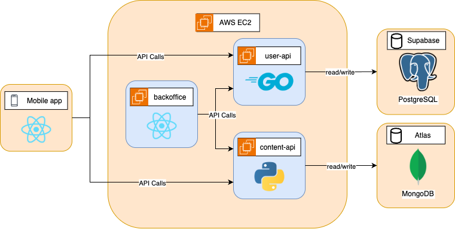

# 🎶 Proyecto Melodía – Documentación Integral

Bienvenido al repositorio central de **documentación** del proyecto **Melodía**, desarrollado en el marco de la materia **Ingeniería de Software II (FIUBA)**.

Aquí se encuentran recopilados los conceptos principales, la planificación, las decisiones de arquitectura y la organización general del desarrollo.  

Cada repositorio complementario incluye documentación específica de su implementación, pero este espacio busca **unificar la visión global del proyecto**.

👉 [Documentación del Proyecto](https://fiuba-ingsoft2-grupo8.github.io/)

## 📖 Introducción

En este repositorio se encuentra toda la **documentación integral** relacionada al proyecto:

- ✅ Decisiones de arquitectura.
- ✅ Tareas realizadas por sprint.
- ✅ Problemas detectados.
- ✅ Stacks tecnológicos elegidos.
- ✅ Explicaciones de uso y de despliegue.

La idea principal es **englobar los conceptos más grandes** y dejar asentada una planificación tentativa sobre cómo se organizará el desarrollo del trabajo práctico.

## 🏗️ Arquitectura Global

### 📌 Diagrama General de Arquitectura

#### Arquitectura actual

#### Arquitectura

Actualmente la arquitectura esta formada por los siguientes servicios:
- Mobile app: app mobile que se conecta a user-api y content-api
- Backoffice: pagina web para dministrar
- user-api: para gestionar usuarios
- content-api: para gestionar contenido como artistas, canciones y playlists
- PostgreSQL
- MongoDB
- Datadog: recibira los logs de todos los servicios y se podrán generar dashboards para mejorar la visibilidad sobre todo el sistema

La versión final incorporara los siguientes elementos:
- Firebase: para poder almacenar los archivos multimedia
- chat-api: se encargara de la funcionalidad de chat
- notifications-api: se encargara de la funcionalidad de notificaciones
- player-api: se encargara de la función de reproducir canciones

## ♾️ CI/CD

Cada microservicio contará con un pipeline de **CI/CD** independiente para garantizar **calidad**, **minimizar errores en producción** y **acelerar el ciclo de feedback**.

### 🔄 Continuous Integration (CI)

El flujo de CI corre cada vez que se realiza un PR o un cambio en las ramas main y develop.

**Infraestructura:** Utilizamos **GitHub Actions** con runners hosteados por GitHub, proporcionando mayor velocidad y confiabilidad.

**Pipeline de CI incluye:**
- 🧪 **Testing automatizado:** Cobertura mínima del 75% con reportes automáticos en cada PR
- ✅ **Validaciones de calidad:** Linters, formatters y análisis estático de código  

**Flujo específico por tecnología:**
- **Backend (Node.js/Python):** Jest/PyTest + ESLint/Pylint + SonarQube
- **Frontend (React Native):** Jest + ESLint + Expo CLI validations  
- **Docker:** Hadolint para validación de Dockerfiles

### 🚀 Continuous Deployment (CD)

El flujo de CD corre luego de realizar un merge o un push en la rama main.

**Proceso automatizado en dos etapas:**

1. **Build & Registry:**
   - 📦 Construcción de imagen Docker optimizada (multi-stage builds)
   - ⬆️ Push automatizado a **Docker Hub** con versionado

2. **Deployment:**
   - 🔄 Pull de la nueva imagen desde el registro
   - 🗑️ Eliminación controlada del contenedor anterior
   - 🟢 Despliegue con **zero-downtime** usando health checks
   - 🔐 Gestión segura de variables de entorno via **GitHub Secrets**

Se utilizan secretos de Github para compartir variables de entorno.

### ♟️ Estrategias CI/CD por Componente

#### 📊 Microservicios (Backend)
- **CI/CD completo:** Pipeline integral con testing, build y deployment automatizado
- **Testing robusto:** Pruebas unitarias y de integración con **cobertura mínima del 75%**
- **Deployment:** deployment en AWS EC2
- **Monitoreo:** Health checks, logs estructurados y métricas de performance

#### 🖥️ Backoffice (Web)
- **CI robusto:** Linting, testing y análisis de bundle size
- **Deployment:** deployment en AWS EC2

#### 📱 Aplicación Móvil (React Native + Expo)
- **CI enfocado en calidad:** Validaciones de linter y formatter
- **Build automatizado:** Generación de APK/IPA en cada release
- **Distribución:** Deploy manual del APK

## 🏗️ Infraestructura y Servicios

Nuestro ecosistema utiliza una infraestructura cloud:

### 🖥️ Compute & Hosting

#### **Amazon EC2 - Instancias t3.micro**
- **user-api:** Microservicio de gestión de usuarios
- **content-api:** Microservicio de gestión de contenido
- **backoffice:** Aplicación web administrativa

**Características:**
- ⚡ 2 GB de memoria RAM
- 🌍 Región AWS optimizada para latencia en América del Sur
- 🔒 Configuración con security groups restrictivos

### 🗄️ Bases de Datos

#### **Supabase - PostgreSQL**
- 🔧 **Uso:** Base de datos relacional principal
- ✅ **Beneficios:** Backend-as-a-Service con autenticación integrada, APIs REST automáticas
- 🔐 **Seguridad:** Row Level Security (RLS) y conexiones SSL/TLS

#### **MongoDB Atlas - Hosteado en AWS**
- 🔧 **Uso:** Base de datos NoSQL para datos no estructurados
- ✅ **Beneficios:** consultas flexibles
- 🌐 **Integración:** Mismo proveedor cloud para minimizar latencia

### 📦 Registry & Contenedores

#### **Docker Hub**
- 🏷️ **Registro de imágenes:** Almacenamiento centralizado de contenedores
- 🔄 **Versionado:** Gestión semántica de releases
- ⚡ **Optimización:** Imágenes multi-stage para reducir tamaño

## ⚙️ Microservicios Planificados

Los siguientes microservicios componen el ecosistema del proyecto:

- 💬 **Chat.**  
- 🎵 **Reproducción.**  
- 🔔 **Notificaciones.**  
- 👤 **Usuarios.**  
- 📂 **Contenido.**  
- 📊 **Monitoreo.**

Cada uno de ellos está diseñado para ser **autónomo**, alineado con las mejores prácticas de desarrollo distribuido.

## 📂 Repositorios del Proyecto

- 📘 **fiuba-ingsoft2-grupo8.github.io** → Repositorio actual que contiene la documentación integral.  
- 🏛️ **.github** → Contiene el README de la organización con la introducción y presentación del grupo.  
- 📱 **melodia-app-mobile** → Aplicación móvil desarrollada en React Native + Expo.  
- 🖥️ **melodia-backoffice** → Aplicación web de backoffice utilizada por administradores para interactuar con el sistema.  
- 📂 **content-api** → Microservicio encargado de la gestión de contenido (playlists, canciones, etc.).  
- 👥 **user-api** → Microservicio encargado de la gestión de usuarios.    

## 📅 Cronograma Tentativo

El desarrollo se planificó en checkpoints con objetivos claros y medibles.  
Este cronograma puede adaptarse según los resultados de cada sprint, pero sirve como guía de avance del proyecto.

### 🔹 Segundo Checkpoint (4 semanas)

**Objetivos principales:**
- 📱 Entregar un **APK funcional** para que el corrector pueda probar la app.  
- 🔑 Implementar el **sistema de autenticación de usuarios** mediante **OAuth + JWT**.  
- 🌐 Desarrollar el **API Gateway** para la comunicación entre microservicios.
- 📈 Desarrollar el **Servicio de Métricas** para monitorear el sistema.  
- 🎨 Definir y documentar los **bocetos de las vistas** principales de la aplicación. 
- 📁 Implementar **Firebase**

**Épicas incluidas:**
- Usuarios.  
- Perfil.  
- Artistas.  
- Biblioteca.  
- Administración de Contenido.  
- Administración de Usuarios.  
- Explorar.

### 🔹 Tercer Checkpoint (3.5 semanas)

**Objetivos principales:**
- 📊 Incorporar **métricas en el Backoffice**.  
- ✅ Validar que se cumplen los **requisitos optativos necesarios** para la materia.  

**Épicas incluidas:**
- Reproducción.  
- Métricas.  
- Notificaciones.  
- Social.  
- Onboarding de Usuario.  

### 🔹 Cuarto Checkpoint (3 semanas)

**Objetivos principales:**
- 🧩 Implementar **pruebas de integración** sobre todos los servicios.  
- 📚 Completar y consolidar toda la **documentación integrable**.  
- 🧪 Realizar **testing masivo** de la app y el backoffice, verificando los criterios de aceptación.  
- 📝 Confirmar que todos los **microservicios generan logs consistentes**.  
- 📊 Verificar el correcto funcionamiento de las **métricas en todo el sistema**.  

## 📅 Cronograma Real

### 🔹 Primer Checkpoint (4 semanas)

#### Camila

1. ✅ Armado de la estructura del endpoint. Database, Controller, Model, Schema
2. ✅ Desarrollo de endpoints de songs
3. ✅ Armado de las pruebas y debugging en local
4. ✅ Configuración del testing para deploy
5. ✅ Documentación sobre stack elegido

#### Esteban

1. ✅ Puesta en marcha del repositorio con Docker para local y remoto
2. ✅ Conexión con MongoDB desde content-api
3. ✅ Armado del deploy para produccion
4. ✅ Desarrollo de endpoints de playlist

#### Felipe

En este primer checkpoint trabajo en el desarrollo inicial, y conexiones a servicios, de la 'App Mobile':

1. ✅ Capacitación inicial en TypeScript, React, React Native y JavaScript.
2. ✅ Reuniones de equipo para comprender en profundidad el enunciado.
3. ✅ Definición de arquitectura → elección de Expo por sus ventajas en desarrollo móvil.
4. ✅ Configuración de entorno local y emuladores Android.
5. ✅ Desarrollo de las primeras pantallas y conexión con APIs (local y en la nube).

#### Joaquín

Trabaje en las APIs del backend, el flujo CI/CD y en la infraestructura:

1. ✅ Crear organización en Github
2. ✅ Levantar instancias en AWS EC2 para user-api, content-api y el backoffice
3. ✅ Levantar bases de datos en Supabase (PostgreSQL) y Atlas (MongoDB)
4. ✅ Configurar estructura inicial (Dockerfile, Docker Compose, Makefile, etc) de user-api y content-api
5. ✅ Desarrollar endpoints básicos para la user-api
6. ✅ Configurar Github Runners
7. ✅ Configurar CI/CD para user-api y content-api
8. ✅ Documentar diagrama de arquitectura y CI/CD

#### Martín

1. ✅ Creación del repositorio con un Backoffice muy básico 
2. ✅ Levantar el backoffice con un compose que funcionaba para hacer pruebas de manera local
3. ✅ Levantar el backoffice con el compose-remote que se conectaba con la base de datos y le pegaba a los Endpoints de la API del usuario
4. ✅ Emprolijar un poco el frontend (botoón y título)
5. ✅ Creacion de un archivo CI que corre un Linter al pushear
6. ✅ Creación del archivo CD para que al pushear o realizar un pr a main se haga el Deploy a AWS.
7. ✅ Documentar bien el Readme, explicando como se levanta el backoffice y justificaciones del stack elegido.
   

## 🏆 Conclusión

Este repositorio refleja la **visión global** del proyecto Melodía, alineado con las mejores prácticas de **ingeniería de software**, con foco en:  
- 🔒 Seguridad.   
- 📈 Escalabilidad.   
- 🧹 Calidad de código.   
- 📖 Documentación clara.   

El objetivo final es entregar un producto robusto, bien documentado y de calidad profesional, listo para ser evaluado y utilizado.  
